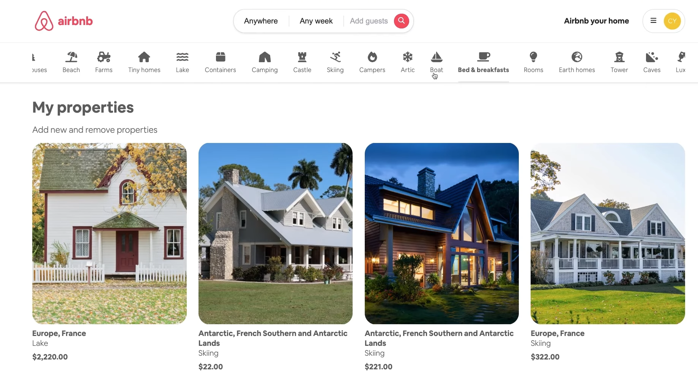

# Clone do Airbnb Backend

## Visão Geral

Esta é uma implementação completa do backend de um clone do Airbnb construído com Spring Boot e PostgreSQL. A aplicação fornece funcionalidades robustas para gerenciamento de usuários, listagem de propriedades e serviços de reserva, seguindo princípios modernos de arquitetura de software.

Acesse o repositório do front:[Airbnb-Frontend](https://github.com/MatheusOtenio/Airbnb-Clone_Angular-Front)

## Tecnologias Utilizadas

- **Java** - Linguagem de programação principal
- **Docker** - Contêineres para desenvolvimento e implantação
- **Spring Boot** - Framework de aplicação
- **PostgreSQL** - Banco de dados relacional
- **RESTful API** - Estilo de arquitetura de API
- **Cloudinary** (inferido a partir dos campos imageUrl/publicId) - Gerenciamento de imagens na nuvem

### Arquitetura Limpa

A aplicação segue uma abordagem de arquitetura limpa com clara separação de responsabilidades:

### Estrutura de Pacotes

O código é organizado por domínio com uma estrutura baseada em recursos:

- `fr.codecake.airbnbclone.user` - Funcionalidade de gerenciamento de usuários
- `fr.codecake.airbnbclone.listing` - Funcionalidade de listagem de propriedades
- `fr.codecake.airbnbclone.booking` - Funcionalidade de gerenciamento de reservas

## Modelo de Domínio

### Gerenciamento de Usuários

- **Entidade User**: Armazena informações pessoais (firstName, lastName, email)
- **Entidade Authority**: Gerencia permissões baseadas em papéis
- Manipulação de imagem de perfil com IDs públicos para armazenamento na nuvem
- Gerenciamento seguro de senhas

### Listagens

- **Entidade Listing**: Informações principais da propriedade (título, descrição, capacidade, comodidades, preço)
- **Entidade ListingPicture**: Gerencia imagens da propriedade com suporte a imagem de capa
- **BookingCategory**: Categorização de propriedades por tipo
- Informações de localização para busca geográfica
- Associação com proprietário (dono da propriedade)

### Reservas

- **Entidade Booking**: Gerencia reservas com intervalos de datas
- Cálculo de preço baseado na duração e taxas da propriedade
- Rastreamento de número de hóspedes
- Associações entre inquilinos e listagens

## Endpoints da API

### Gerenciamento de Usuários

- Registro de usuário e gerenciamento de perfil
- Autenticação e autorização
- Upload e gerenciamento de imagem de perfil

### Listagens

- Criação, atualização e exclusão de propriedades
- Upload de imagem com seleção de imagem de capa
- Busca e filtragem de propriedades
- Navegação baseada em categorias

### Reservas

- Verificação de disponibilidade
- Criação e gerenciamento de reservas
- Histórico de reservas para usuários

## Segurança

- Autenticação baseada em JWT
- Autorização baseada em papéis
- Tratamento seguro de senhas
- Endpoints protegidos

## Design do Banco de Dados

- Modelo de banco de dados relacional com PostgreSQL
- Relacionamentos entre entidades com restrições adequadas
- Consultas otimizadas para desempenho

## Configuração e Instalação

1. Clone o repositório
2. Configure a conexão do banco de dados PostgreSQL nas propriedades da aplicação
3. Configure variáveis de ambiente para informações sensíveis
4. Execute a aplicação usando Maven: `mvn spring-boot:run`

## Referências

[@code-cake](https://www.youtube.com/@code-cake)
[Spring Boot](https://spring.io/projects/spring-boot)
[PostgreSQL](https://www.postgresql.org/)
[Hibernate](https://hibernate.org/)
[Cloudinary](https://cloudinary.com/)
[JWT](https://jwt.io/)
[Spring Security](https://spring.io/projects/spring-security)
[Docker](https://www.docker.com/)
